# 🌉 Bifrost

**Verifiable Nearest Neighbor Search powered by RISC Zero + zkVerify + Horizen**

Bifrost is a **trustless vector search engine**. It allows you to:

  * Convert text (or structured data) into **embeddings**.
  * Store datasets with embeddings and cryptographic commitments.
  * Run **queries** and compute similarity (Euclidean distance).
  * Generate **zk-proofs** (via RISC Zero) that the nearest neighbor is correct.
  * Submit proofs to **zkVerify** for low-cost, fast, universal verification.

-----

## ✨ Why Bifrost?

Modern AI applications rely on vector databases for recommendations, search, and retrieval. However, users can't typically verify whether the result returned by the service is **honest** or optimal.

Bifrost solves this by ensuring:

  * 🔒 The **entire dataset** was searched.
  * 🎯 The **closest vector** was correctly chosen.
  * 🌐 Results can be verified on-chain via **zkVerify**.

-----

## 🏛️ Architecture

Bifrost provides an end-to-end verifiable computation flow, from data processing to on-chain verification and final presentation.

1.  **Input & Embedding**: The user provides a dataset and a query. Using a local model via **Ollama**, the system generates vector embeddings for the data.
2.  **Search & Prove**: The system performs a nearest neighbor search to find the most similar vector. A **Zero-Knowledge Proof** is then generated using **RISC Zero**, attesting that the search was executed correctly over the entire dataset.
3.  **Verify & Relay**: The ZK proof is sent to **zkVerify** for efficient and universal verification.
4.  **On-Chain Check**: A smart contract deployed on the **Horizen** blockchain checks if the aggregate proof has been verified by zkVerify.
5.  **Frontend Display**: The frontend application queries the smart contract to confirm the verification status and displays the result to the user, marked as either "valid" or "invalid".

```mermaid
graph TD
    A[👤 User <br/> Inputs Data & Query] --> B[🧠 Ollama <br/> Generates Vector Embeddings];
    B --> C[🔎 Nearest Neighbor Search];
    C --> D[🔒 RISC Zero <br/> Generates ZK Proof];
    D --> E[✅ zkVerify <br/> Verifies Proof];
    E --> F[📜 Horizen Smart Contract <br/> Checks Verification Status];
    F --> G[💻 Frontend <br/> Displays Result & Validity];
```

<!-- end list -->



-----

## ⚡️ Setup

### Prerequisites

  * [Rust](https://rustup.rs/)
  * [Ollama](https://ollama.com/) (for local embeddings)
  * [RISC Zero](https://github.com/risc0/risc0) (for zkVM proving)
  * [zkVerify SDK](https://docs.zkverify.io/) (for submitting proofs)

-----

## 🔎 Usage

### 1\. Prepare dataset

Create a JSON file with your data (e.g. `movies.json`):

```json
[
  { "name": "Star Wars", "description": "A space adventure with galactic battles" },
  { "name": "The Godfather", "description": "Mafia family struggles in New York" },
  { "name": "Inception", "description": "A thief enters dreams to steal secrets" }
]
```

### 2\. Generate embeddings (Index)

```sh
cargo run --bin embedder index -p ./data/movies.json
```

👉 Produces `movies.index.json` with embeddings + SHA256 hashes.

### 3\. Generate query embedding

```sh
cargo run --bin embedder query -p ./data/movies.json -t "A young hero fights in space"
```

👉 Produces `movies.query.json`.

### 4\. Run nearest neighbor search

Use the Euclidean distance search function:

```rust
let best_idx = compute_best_sample(&samples, &query);
println!("Best match: {}", metadata[best_idx].name);
```

Example output:

```
Best match: Star Wars
Description: A space adventure with galactic battles
```

-----

## 🚀 Deployment

  * **Live Demo**: [https://bifrost.app](https://bifrost-ebon.vercel.app/)
  * **Smart Contract on Horizen Testnet**: [`0xDa71...210a2`](https://www.google.com/search?q=%5Bhttps://horizen-explorer-testnet.appchain.base.org/address/0xDa713271a47abd0421183c330f720a67C69210a2%3Ftab%3Dtxs%5D\(https://horizen-explorer-testnet.appchain.base.org/address/0xDa713271a47abd0421183c330f720a67C69210a2%3Ftab%3Dtxs\))

-----

## 📊 Example Run

  * **Dataset**: `movies.json` (10 movies).
  * **Query**: `"A young hero fights in space"`.
  * **Result**: `Star Wars`.
  * **Proof**: Verified on zkVerify and confirmed by the Horizen smart contract.
